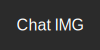

# Chat-IMG

<p align="center"></p>

> 개인프로젝트<br>
> 개발기간: 2023.04.01~

## 프로젝트 소개
이미지 묘사 텍스트를 입력받아 이미지를 생성하는 애플리케이션입니다.

해당 프로젝트는 Kakao Karlo API, PaPago API를 사용했습니다. Karlo 모델은 영어만을 지원하기 때문에 사용자가 입력한 한국어 텍스트를 Papago API를 통해 영어로 번역하여 이미지를 생성합니다.

따라서 동음이의어를 사용하실 경우 영어로 작성해주시면 더 정확한 결과를 얻을 수 있습니다.

ex) `밤 -> night`, `다리 -> bridge`

## 기술스택
### Front-End
 


### Back-End


### Deploy

<br>

<br>

## 주요 기능
### :star: 사용자가 입력한 텍스트 번역
- Submit 버튼을 클릭하면 한국어로 입력된 텍스트를 백엔드에서 번역 후 이미지 생성

### :star: 번역된 텍스트를 바탕으로 이미지 생성
- 생성된 이미지는 웹 페이지에서 볼 수 있습니다

### :star: 이미지 다운로드
- 이미지를 생성하고 사용자가 원하는 크기(256~1024)로 다운로드 할 수 있습니다.

## 디렉토리 구조
```
Chat-IMG
├─ README.md
├─ index.js : node.js 서버
├─ package-lock.json
├─ package.json
├─ public
│  ├─ favicon.ico
│  ├─ index.html
|  ├─ logo.svg
│  ├─ manifest.json
│  └─ robots.txt
└─ src
   ├─ App.css
   ├─ App.js
   ├─ App.test.js
   ├─ components
   │  ├─ Header.js
   │  ├─ ImageCreator.js
   │  ├─ ImageOption.js
   │  ├─ InitContent.js
   │  ├─ Main.js
   │  └─ TextContainer.js
   ├─ css
   │  ├─ Header.css
   │  ├─ ImageCreator.css
   │  ├─ ImageOption.css
   │  └─ TextContainer.css
   ├─ index.css
   ├─ index.js
   ├─ reportWebVitals.js
   └─ setupTests.js
```

## 설치 및 실행
이 저장소를 클론하고 다음 명령어를 입력하여 애플리케이션을 실행 할 수 있습니다.

### Clone
```
$ git clone https://github.com/JungHun98/Chat-IMG.git
```

### 서버 실행
```
$ node index.js 
```

### react 서버 실행
```
$ cd src
$ npm start 
```

⚠️ 해당 서비스는 Kakao Kalro API, Papago API의 APP KEY가 환경변수로 설정되어있어 별도의 APP KEY가 필요합니다.

루트 디렉토리(CHAT-IMG)에 `.env` 파일을 생성하시고 발급받은 APP KEY를 설정해 주십시오.

### Kalro API KEY
```
KARLO_API_KEY = YOUR_APPKEY
```

### Papago API KEY
```
CLIENT_ID = YOUR_APPKEY;
CLIENT_SECRET = YOUR_APPKEY;
```
